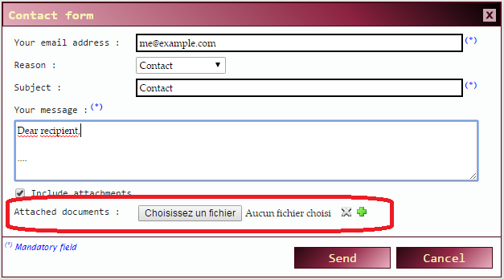
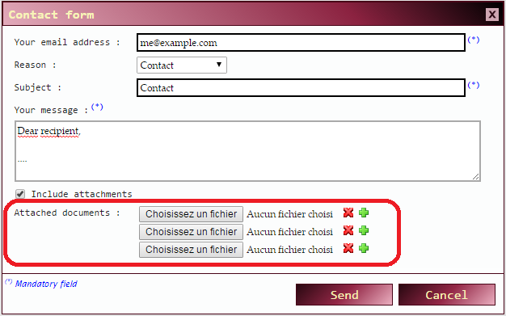
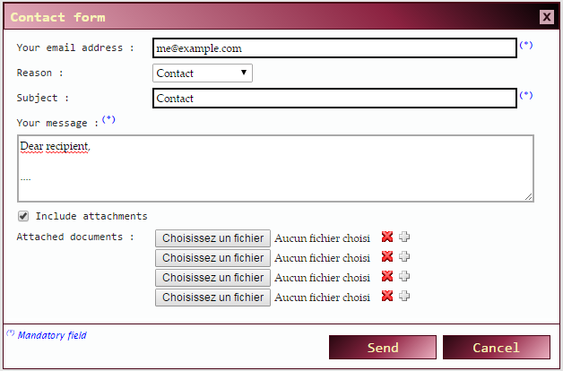

# INTRODUCTION #
**$.repeatable** is a jQuery widget that takes a set of html elements and adds *plus* and *minus* buttons that allow to duplicate them.

The original idea came from the need to include one or more file attachments in a very simple form that did not require too complicated uploader widgets ; an example is given below :

A simple UI, using *plus* () and *minus () buttons, allows to duplicate the current set of html elements (here, a form field of type *&lt;input type="file"/&gt;*) :

 
And, when you reach the maximum number of repetitions (4, in this precise example), then the UI changes a little bit :

Note how the *plus* () button became grayed () : You cannot add more files any more because the limit (4) has been reached. However, you can delete any instance you like using the  button.
 

# HOW TO USE IT ? #

The code excerpts presented here come from [index.html](index.html), which contains a small, quick and dirty example, that define a repeatable group of text and file input fields.

## STEP 1 : Define a &lt;div&gt; container for your html template ##
Your first task will be to define html content that will be used as a template for duplication.

Here is a *div* that includes two input fields, one of type text and one of type file, together with their respective labels ; this block of html code will serve as a template for generating instances :

	

	    Value : 
	    <input type="text" id="value" name="values[]"/>
	    Attached file : 
	    <input type="file" name="files[]" />
	

A few remarks here :

- The optional "min-instances" and "max-instances" attributes specify the minimum and maximum number of occurrences you authorize the user to create
- The *class="repeatable"* attribute only serves as a way to select this template using jQuery.
- The *id* attribute is not mandatory ; it could just only serve to refine your jQuery selections if you have more than one repeatable template on the same page.
- Note the **"[]"** in the *name* attribute of the *&lt;input&gt;* fields : This is mandatory if you want your PHP form handling script to receive field values as an array. For example, *$values[0]* will be set to the first *value* field of your form, *$values[1]* to the second, and so on.

## STEP 2 : Include the necessary files ##

1) You first need jQuery and jQuery UI :

	
	

2) then include the repeatable.js script :

	

3) And finally include a CSS for styling (one example stylesheet, [css/repeatable.css](css/repeatable.css), is provided with this package) :

	<link rel="stylesheet" href="css/repeatable.css"/>
	
## STEP 3 : Declare your "repeatable" elements ##

This is done by calling the *repeatable()* function on selected jQuery elements :

	

# HOW DOES THIS WORK ? #

The container you defined at step #1 is transformed and looks this way after processing (there will be as many samples of the code below as there are instances) :

	

	    Value : 
	    <input type="text" id="value" name="values[]"/>
	    Attached file : 
	    <input type="file" name="files[]" />
	

	
	
	    

	    

	

Note the following differences :

- The "min-instances" and "max-instances" attributes have been removed
- The instance of your *div* template has been added a class, *repeatable-instance*.
- A new *div* has been added next to your template instance. It defines the shape of the button set that allows the user to add or remove instances

The **$.repeatable** widget then automatically handles user clicks on the *plus* and *minus* buttons to add/remove html blocks based on your template.

# REFERENCE #

## Methods ##

### repeatable ( [options] ) ###
Initializes a repeatable object on the selected jQuery elements. *options* is a an object that can have the following members :

- *minInstances* : Minimum number of instances for the repeatable element. This value is overridden with the *"min-instances"* attribute of the template, if specified.
- *maxInstances* : Maximum number of instances for the repeatable element. This value is overridden with the *"max-instances"* attribute of the template, if specified.
 
## Css Classes ##

### Template instance ###
A template instance is added the class *repeatable-instance*, which can be used to further style it (for example, to add a bottom margin to separate consecutive instances).

### Buttonset instance ###
A button set is appended next to each template instance ; it can have the following classes :

- *repeatable-buttonset* : used to style the whole buttonset itself
- *repeatable-buttonset-default* : set when the buttonset uses the default builtin buttonset template. In the current version, no provision is made to support custom buttonsets.
- *repeatable-buttonset-first* : set for the first template instance.
- *repeatable-buttonset-last* : set for the last template instance.

Each button set contains two inner *div* elements, for the *plus* and *minus* buttons. They have the following classes that can be styled :

- *repeatable-button* : general class to style ALL the button sets individual buttons
- *repeatable-button-plus* : used to style the *plus* button.
- *repeatable-button-minus* : used to style the *minus* button.
- *repeatable-button-disabled* : set when the corresponding button is disabled. This is the case for the *minus* button when only one instance is present and the *minInstances* parameter is greater than zero ; or for the *plus* button when the maximum number of instances has been reached.

See [css/repeatable.css](css/repeatable.css) for an example style sheet. As you might guess, button images are referenced there...