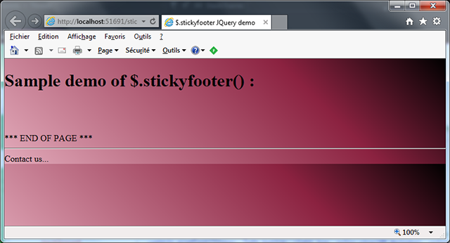
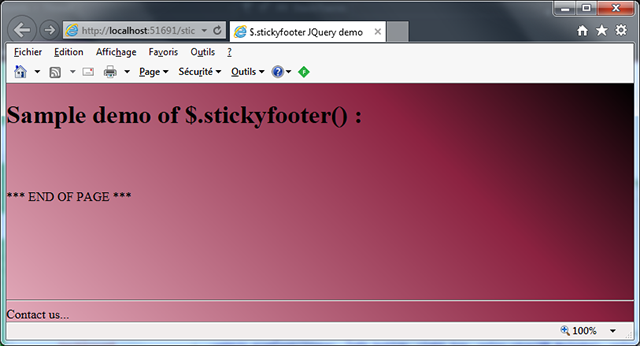
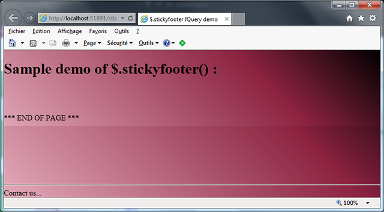

# INTRODUCTION #

StickyFooter is a small jQuery component that helps html contents to *stick* to the bottom of the browser window, when the inner html page content are smaller than the browser window size.

As an example, this is useful for displaying the traditional "contact me - legal mentions" and other stuff that we all like to see at the end of the pages we visit...

But please keep this strongly in mind : the footer will appear at the bottom of the browser window only if the height of the html page displayed is less than the height of the browser window. Should the html page be taller, the footer will appear outside of the screen and you will have to scroll down in the browser window to make it appear. This, definitely, is not a bug but my intended way of doing it...

# EXAMPLE #
The following example shows a short html page ending with "*** END OF PAGE ***" ; the background of the <body> element has been set to have a linear color gradient, AND sticky footer is NOT enabled :

If you maximize your browser window, you will notice that the color gradient is repeated several times vertically ; by enabling the stickyFooter on your footer htlm contents, you will see :

Notice now that the color gradient is spreading the whole window.

# HOW TO USE IT ? #

This is really simple ; first, include jQuery :

	

Then include the stickyfooter source :

	

Put in your page body the html code that represents your footer (it is simpler to enclose it within a *div* element) :

		

			

			Contact us...
		

 
Finally, call the stickyFooter() function after your page has been loaded, on the html element(s) you declared in the previous step :

	

# HOW DOES IT WORK ? #

Well, there is no magic in that. 

The top margin of your footer (identified by *id="stickyfooter"* in the above example) will be adjusted if the html page height is less than the browser window height, so that the footer will appear to "stick" to the bottom of the window. This remains true even if you change the window size, since the stickyfooter component handles window resize events.

Adversely, the margin of your footer html code ('#stickyfooter' in the above example) will be set to 0 if your page is longer than the browser's window height. The footer will now appear, not at the bottom of the window, but at the bottom of the page and you will have to scroll down to make it visible.

# CAN I MODIFY THIS BEHAVIOR DYNAMICALLY ? #

Do you mean "Can I enable then disable *stickyfooter* dynamycally without reloading the page ?"...

Well, if you want an answer to that question, ask it to someone else but not me...

If you want a quick glance at what might happen for example if you enable the stickyfooter AFTER the page has been loaded, have a look at the following screen shot :

 

Noticed how the color gradient appears twice this time ? 

However, if you have a solution or explanation for this, feel free to contact me at christian.vigh@orange.fr !
